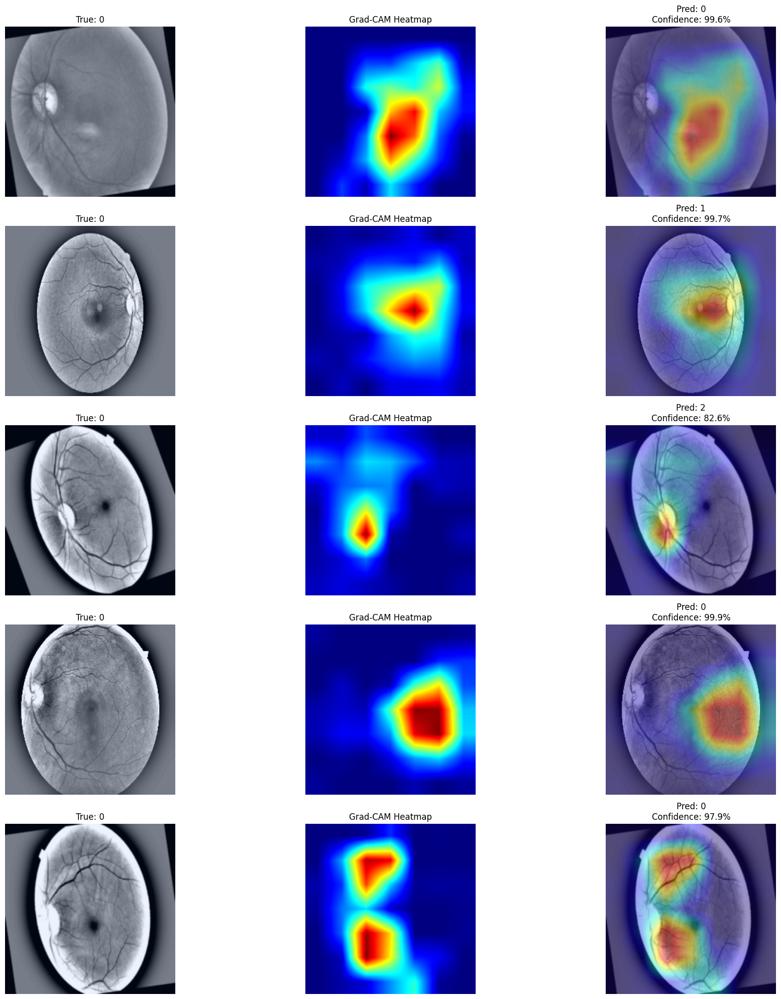
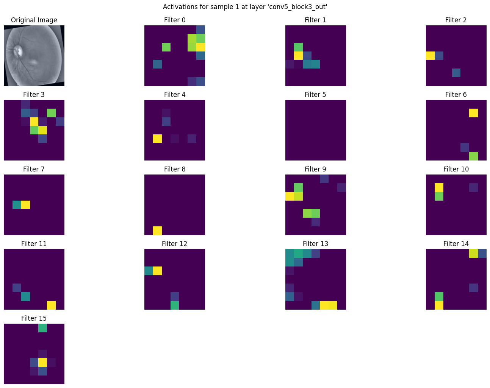
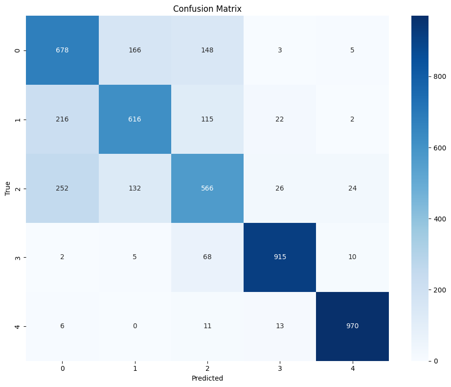
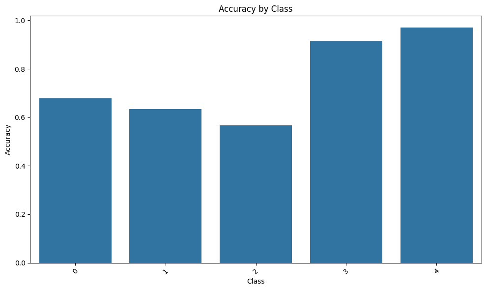
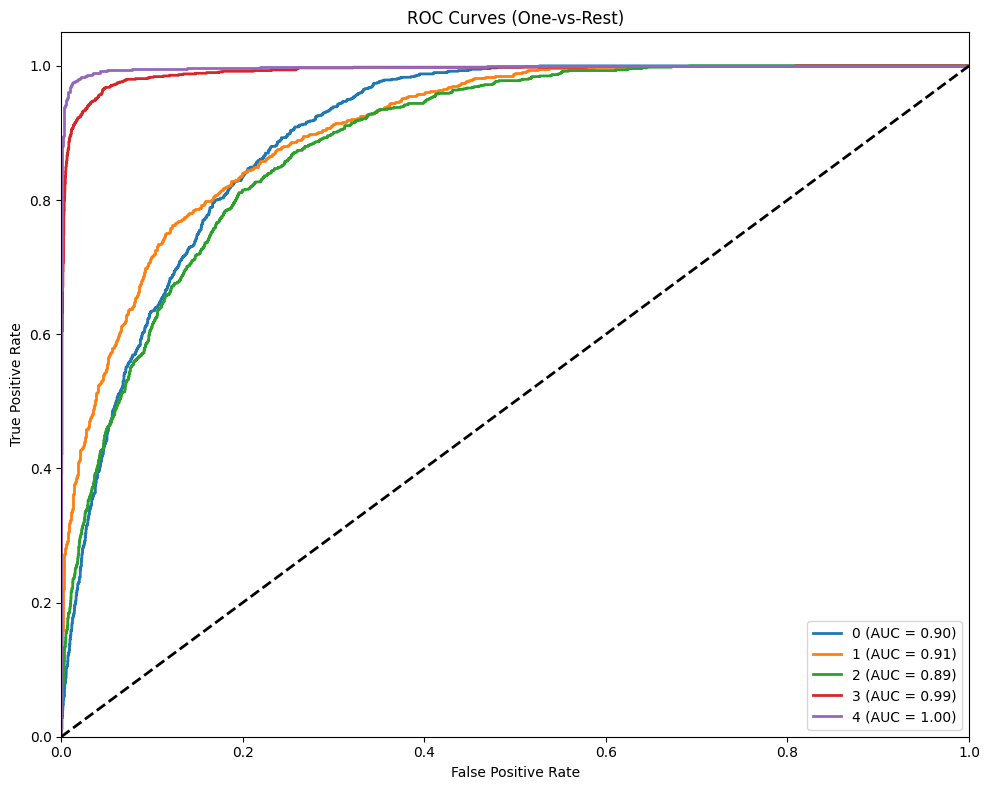
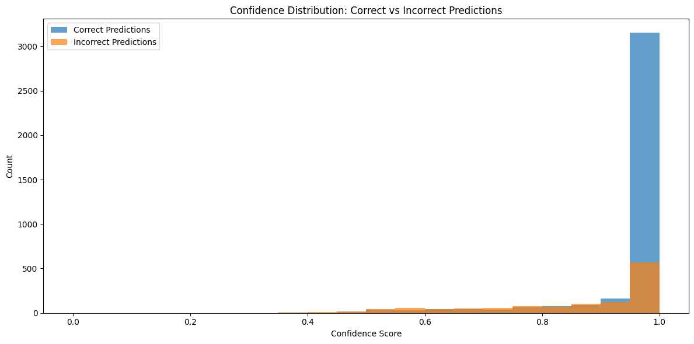

# diabetic-retinopathy-classifier

A deep learning-based solution that classifies diabetic retinopathy severity levels from retinal images using a hybrid CNN-Transformer architecture.

This project implements a hybrid image classification model combining ResNet50 (CNN) and a custom Vision Transformer (ViT) feature extractor. It leverages TensorFlow and Keras to build and train the model, and includes comprehensive evaluation and explanation.

## Model Architecture

The hybrid model combines ResNet50 and a custom ViT feature extractor:

- **ResNet50 Branch**: Uses a pre-trained ResNet50 model (excluding the top layer) for CNN feature extraction.
- **ViT Branch**: Implements a custom ViT feature extractor layer with learnable patch embeddings, class token, position embeddings, and transformer blocks.
- **Concatenation**: Concatenates the features from both branches and passes them through dense layers for final classification.

## Dataset

The dataset is organized into `train`, `val`, and `test` directories, each containing subdirectories for each class. Images are resized to 224x224 pixels.

## Evaluation Results

### Classification Report

| Class | Precision | Recall | F1-score | Support |
|-------|-----------|--------|----------|---------|
| 0     | 0.59      | 0.68   | 0.63     | 1000    |
| 1     | 0.67      | 0.63   | 0.65     | 971     |
| 2     | 0.62      | 0.57   | 0.59     | 1000    |
| 3     | 0.93      | 0.92   | 0.92     | 1000    |
| 4     | 0.96      | 0.97   | 0.96     | 1000    |
| **Accuracy** |   |   | **0.75** | **4971** |
| **Macro avg** | 0.76      | 0.75   | 0.75     | 4971    |
| **Weighted avg** | 0.76   | 0.75   | 0.75     | 4971    |

### Detailed Class Performance Analysis

| Class | Accuracy | Samples | Most Common Error | Error % | Avg Conf | Min Conf | Max Conf |
|-------|----------|---------|-------------------|---------|----------|----------|----------|
| 0     | 0.68     | 1000    | 1                 | 0.17    | 0.94     | 0.40     | 1.00     |
| 1     | 0.63     | 971     | 0                 | 0.22    | 0.94     | 0.49     | 1.00     |
| 2     | 0.57     | 1000    | 0                 | 0.25    | 0.93     | 0.36     | 1.00     |
| 3     | 0.92     | 1000    | 2                 | 0.07    | 0.99     | 0.40     | 1.00     |
| 4     | 0.97     | 1000    | 3                 | 0.01    | 0.99     | 0.36     | 1.00     |

## Explanation

### Grad-CAM Explanation

### Layer Activations

## Analysis and visualizations

### Confusion Matrix

### Accuracy by Class

### ROC Curves

### Confidence Distribution

